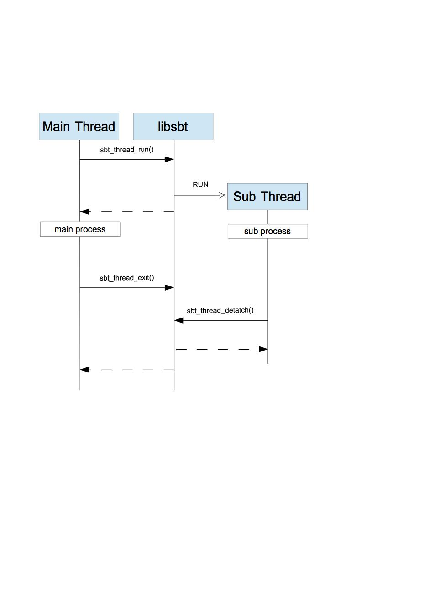

HEAP管理  
--------

HEAPの増減を記録し、ある時点でのHEAP状況を把握する機能を持つ。  

* void* sbt_malloc(size_t size);
* void  sbt_free(void *ptr);
* void sbt_alloc_print_remnants();
* int sbt_alloc_get_allocate_size();

File操作  
--------

File操作機能を持つ。  

* int get_file_num(const char* dir_name);
* int get_file_name_list(const char* dir_name, files_st* list);

ログ管理  
--------

ログ管理機能を持つ。  

* USE_SBT_LOG_MACRO
defineで定義した短縮名を使用する場合に使用する

* void sbt_logln_tofd(FILE* fd, const char* file_name, const char* level, const char* func_name, int line_no, int pid, const char* format, ...);
* void sbt_logln(const char* level, const char* file_name, const char* func_name, int line_no, int pid, const char* format, ...);
* void sbt_flogln(const char* level, const char* file_name, const char* func_name, int line_no, int pid, const char* format, ...);
* void sbt_flog_init(const char* path);
* void sbt_dumpln( const unsigned char* buf, int start_index, int end_index );
* void sbt_dump( const unsigned char* buf, int start_index, int end_index );
* void sbt_mem_dump( void* ptr, unsigned long long num);

文字列操作
----------

文字列操作機能を持つ。  

* int sbt_string_get_strchg_len(const char *buf, const char* before_str, const char* after_str);
* int sbt_string_strchg(char** chg_buf, char *buf, const char *before_str, const char *after_str);
* int sbt_string_split( char** split_str_list, char* source_data, unsigned long long source_size, const char* token_str );

スレッド操作
------------

* void sbt_thread_run( const void* func, const void* f_arg, short int join_flg, long int stk_size);
* void sbt_thread_detatch( );
* void sbt_thread_exit( );

How to use the above functions in case of detatch thread process.  

  

Web関連Tips
-----------

* void sbt_web_html_parse(char** outBuf,const char* inBuf);

Android対応array XMLパース操作
-------------

Androidのリソースフォーマットで定義されたアイテムの配列を取得。  

    <?xml version="1.0" encoding="utf-8"?>
    <resources>
        <string-array name="planets_array">
            <item>Mercury</item>
            <item>Venus</item>
            <item>Earth</item>
            <item>Mars</item>
        </string-array>
        
        <integer-array name="sample_ids">
            <item>1</item>
            <item>2</item>
            <item>3</item>
        </integer-array>
    </resources>

* int sbt_androidxml_get_array_length(const char* file_name, const char* res_name);  
* char* sbt_androidxml_get_string_array(const char* file_name, const char* res_name);  
* int* sbt_androidxml_get_int_array(const char* file_name, const char* res_name);  

